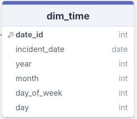
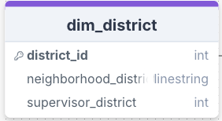
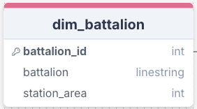
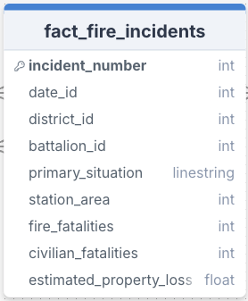
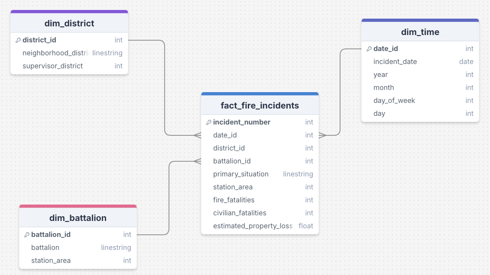
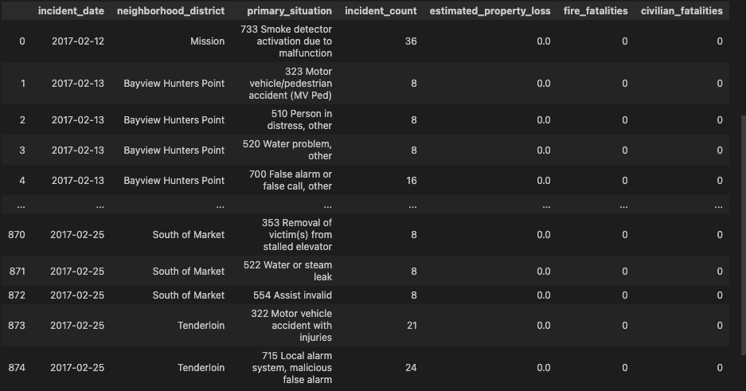
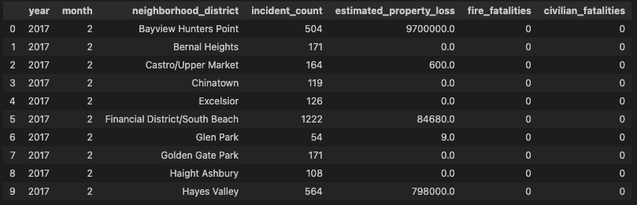

# Fire Incident Challege 

Context
=================

To address this challenge, I chose to use Jupyter Notebook to accelerate prototyping. The notebook can be easily uploaded to Databricks for scheduling or exported as a .py file for use in Airflow, for instance.

The pipeline is designed to run daily, with the exception of a full load to extract the entire database. All tables are saved as .parquet files to simulate a Data Warehouse, ensuring easy access to the information.

The reports were created to illustrate the advantages of using a star schema. The final results are displayed at the end of the file report_generator.

Table of Contents
=================

## Project_Tree
```python
       📦data_models
        ┣ 📂dimension_tables
        ┃ ┣ 📜dim_battalion_fire_incidents.parquet
        ┃ ┗ 📜dim_district_fire_incidents.parquet
        ┃ ┗ 📜dim_time_fire_incidents.parquet
        ┣ 📂fact_table
        ┃ ┣ 📜fact_fire_incidents.parquet
        📦extract_date
        ┣ 📜raw_database.parquet
        📦src
        ┣ ┣ 📜dim_fact_generator.ipynb
        ┃ ┗ 📜load_dataset.ipynb
        ┃ ┗ 📜report_generator copy.ipynb
        ┃📜requirements.txt
```

### Dimension Table: dim_time
#### To support aggregations by different time periods, this table will break down the incident_date into components.


### Dimension Table: dim_district
#### This table will store information about each district in San Francisco.


### Dimension Table: dim_battalion
#### Stores each battalion and its related information.


### Fact Table: fact_fire_incidents
#### This table stores key details for each fire incident and references each dimension via surrogate keys.


## Star Schema

#### A star schema is well-suited for data warehouses where queries often involve aggregations across multiple dimensions. In this schema, you’ll have.

* One central fact table containing the fire incidents data.
* Multiple dimension tables for each category you want to analyze by: time, district, and battalion.



## Reports - agg_incidents

#### This report provides a summary of fire incidents by date, district, and situation, showing how many incidents occurred, the total property loss, and the fatalities associated with each type of incident in each location and time period.



## Reports - report_agg_neighborhood

#### This report summarizes the number of incidents, property loss, and fatalities by neighborhood and month. It would allow you to track fire incidents' impact across districts over time, helping in resource allocation and identifying areas requiring more preventive measures.

